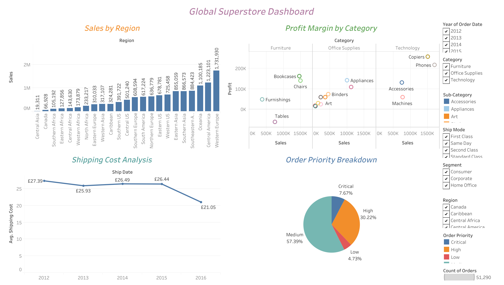

# Tableau Project | JustIT

---

## 📊 Global Superstore Dashboard – Tableau Project

---

## 🎯 Objective

Build an interactive Tableau dashboard using the *Global Superstore* dataset. The dashboard incorporates **four different types of visualizations** to explore key business metrics across regions, categories, and shipping modes.

---

## 📁 Dataset

- **Source:** Global Superstore (CSV/Excel format)
- **Fields Used:** Sales, Profit, Category, Region, Ship Mode, Order Priority, Segment, and Date

---

## 📈 Visualizations Included

### 🔹 1. **Sales by Region**
- **Type:** Bar Chart  
- **Insight:** Total sales per region  
- **Features:**  
  - Sorted by sales (descending)  
  - Year filter to explore trends over time

---

### 🔹 2. **Profit Margin by Category**
- **Type:** Scatter Plot  
- **Insight:** Relationship between sales and profit per product category  
- **Features:**  
  - Color-coded by category  
  - Highlights profit-to-sales correlation

---

### 🔹 3. **Shipping Cost Analysis**
- **Type:** Line Chart  
- **Insight:** Average shipping cost trends over time  
- **Features:**  
  - Time-series analysis  
  - Filter by shipping mode

---

### 🔹 4. **Order Priority Breakdown**
- **Type:** Pie Chart  
- **Insight:** Proportion of orders by priority level  
- **Features:**  
  - Segment and region filters  
  - Percentage of total using table calculation

---

## 🧩 Dashboard Features

- Combined all four visuals into a **single interactive dashboard**
- Applied **linked filters** across visuals for user-driven exploration
- Focused on clean layout and accessibility to ensure ease of use

---

## 📌 Key Takeaways

- Mastered Tableau chart types and filtering techniques
- Gained experience designing multi-visual dashboards
- Demonstrated ability to turn raw data into interactive insights

---

---

> 💡 *This dashboard project showcases foundational Tableau skills in data storytelling and user-centric dashboard design.*

